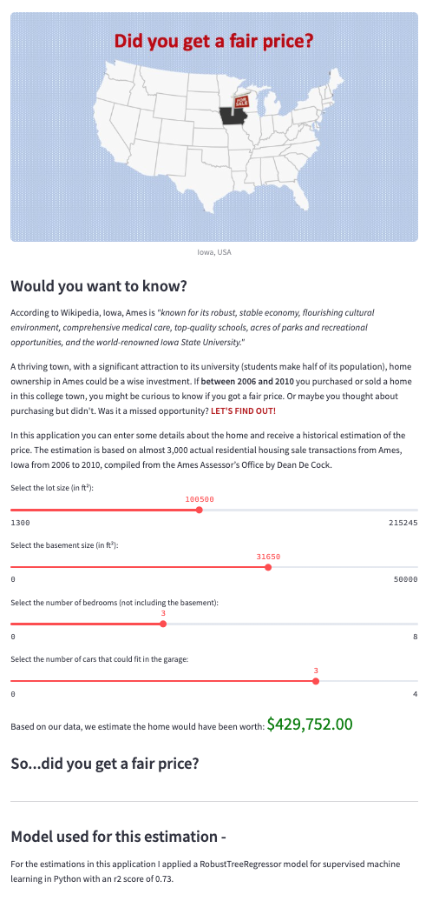

# Web App for Housing Price Prediction using Streamlit and Machine Learning

This project presents a Streamlit app that uses supervised machine learning with Python to predict exact housing prices based on selected property features.

## Situation

This project builds on my earlier work in the repository [**housing-price-prediction-supervised-ml-python**](https://github.com/edictamg/housing-price-prediction-supervised-ml-python), where I created a machine learning model to predict housing prices for a Kaggle competition.

Here, I take the next step: presenting an interactive app that returns an estimated house price based on a few selected features—lot size, number of above-ground bedrooms, basement bedrooms, and garage size (measured by the number of cars it can hold).

The dataset used contains historical home sale prices in Ames, Iowa.

## Approach

The model pipeline includes a `SimpleImputer`, `StandardScaler`, and `VarianceThreshold`, feeding into a `RandomForestRegressor`. I used `RandomizedSearchCV` to optimize hyperparameters and automatically retrained the pipeline with the best parameters.

Although I experimented with `RFECV` using `GradientBoostingRegressor` as an estimator, the final model performed better without these additional feature selection steps.

Model performance was evaluated using the R-squared (R²) metric.

## Preview

Here’s a screenshot of the completed Streamlit app, showing the user interface for entering home features and returning a predicted price:



## Files

### Data
- `housing-deployment-reg.csv`: Housing data used for model training

### Scripts
- `housing_pricing_predictions_model_RandomForestRegressor.ipynb`: Jupyter Notebook containing model training, evaluation, and export via Pickle
- `house_pricing_streamlit_app.py`: Python script that runs the Streamlit app

### Images
- `iowa.pptx`: PowerPoint file used to create the visual for the app
- `home-for-sale-sign.png`: Image of a "For Sale" sign
- `image_Iowa.png`: Image used as the header/banner in the app
- `housing_pricing_app_screenshot.png`: Screenshot of the deployed Streamlit Housing Price App

### Trained_Model
- `trained_pipe_randomforestregressor.sav`: Exported trained model using Pickle

## Using the Files

1. Clone or download this repository.
2. In `house_pricing_streamlit_app.py`, update the file paths for:
   - `image_Iowa.png`
   - `trained_pipe_randomforestregressor.sav`
3. In `housing_pricing_predictions_model_RandomForestRegressor.ipynb`, update paths for:
   - Input data: `housing-deployment-reg.csv`
   - Output model file: `trained_pipe_randomforestregressor.sav`
4. Run the Notebook in Jupyter to reproduce the training process and save the model.
5. From your terminal, deploy the app with:
   ```bash
   streamlit run /[your_file_path]/house_pricing_streamlit_app.py

## Languages and Libraries

- Python 3.10.12  
- pandas 2.2.2  
- scikit-learn 1.4.2  

## Tools

- Jupyter Notebook
- Streamlit

